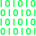

# PyPy.GuRu

## Motivation

I created this website to kickstart my journey into software development and share my knowledge and experiences with the world. The name "PyPyGuRu" came to me as I want to become a guru in Python programming, and it stuck with me since I bought the domain in July 2023. This site marks the official beginning of my journey into the world of programming 🚀.

## Technologies Used

- HTML5
- CSS3
- JavaScript (p5.js library)

## Connect with us

- [Blog](https://blog.pypy.guru/)
- [YouTube](https://www.youtube.com/@pypyguru)
- [GitHub](https://github.com/pypyguru)

---
